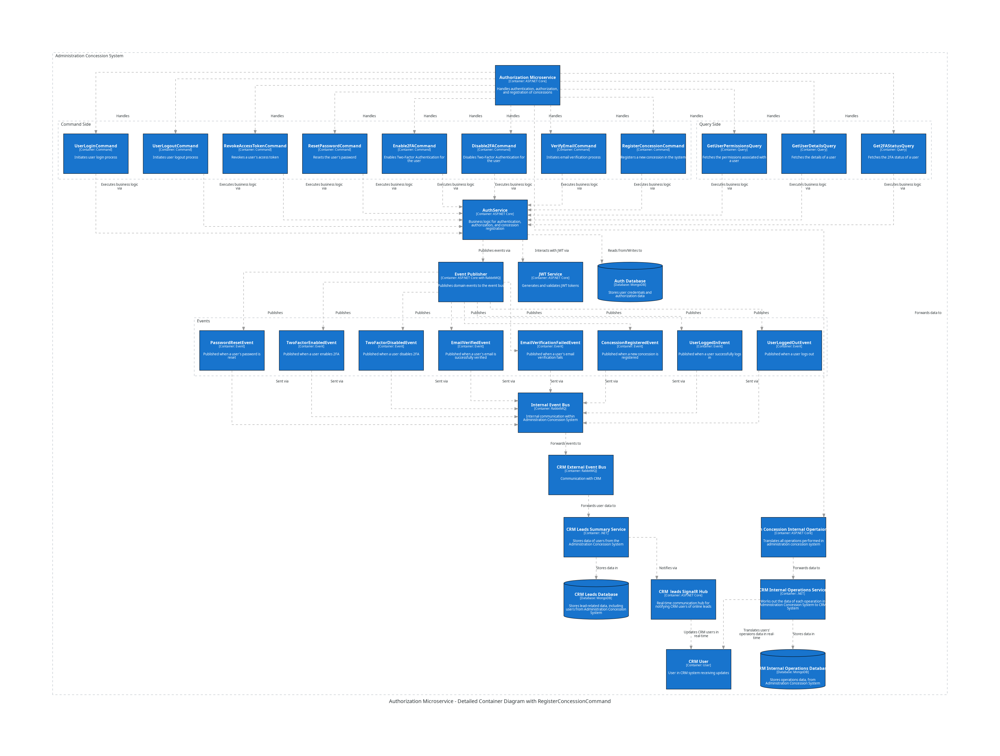

Administration Concession System Internal Statistics Service
==============================================================

The Intrnal Statistics Microservice is responsible for handling recieving and saving  the CRM Intrnal Statistics Service data: services distribution, situation characteristics, current leads summary tendency, general leads tandency

 

API Documentation
-----------------

Commands
--------

Queries
-------

Inbox Events
------------

Outbox Events
-------------

Internal Statistics Service Database Documentation
============================================
