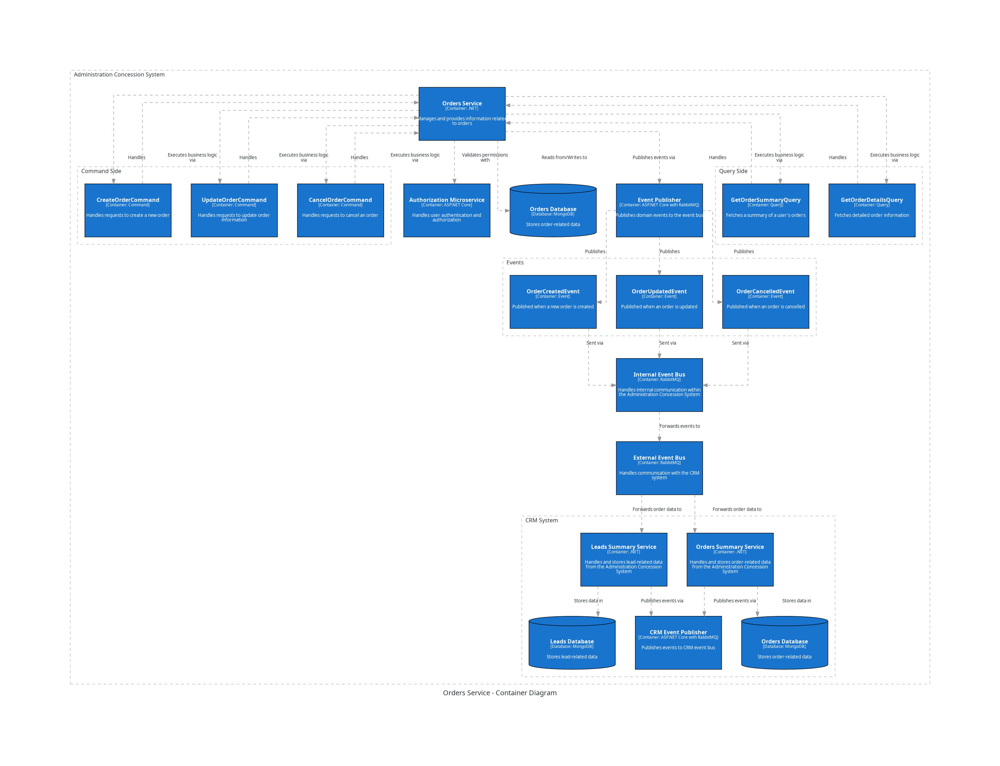

Administration Concession System Payments Service
===================================================

The Orders Statistics Microservice is responsible for handling recieving the orders related data from the CRM Orders service.

 

API Documentation
-----------------

Commands
--------

Queries
-------

Inbox Events
------------

Outbox Events
-------------

Payments Service Database Documentation
============================================
