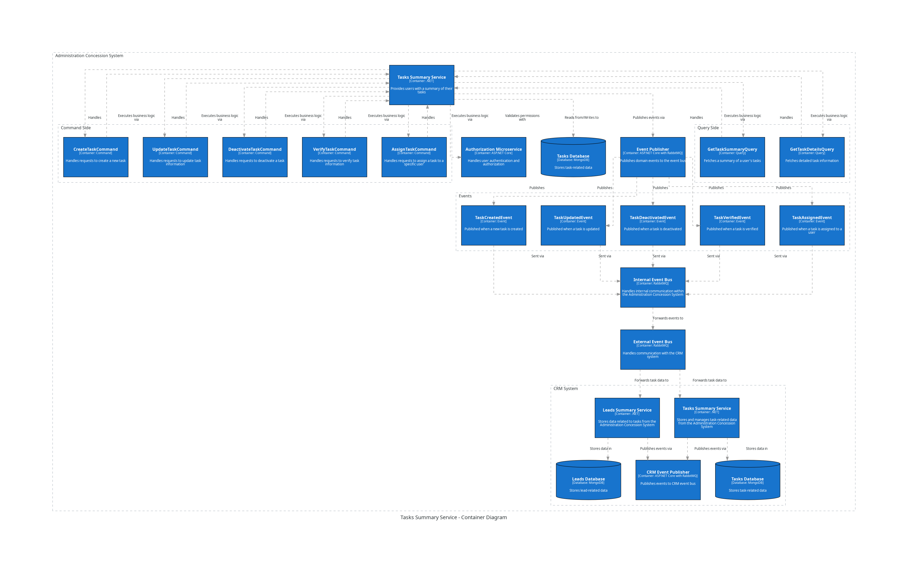

CRM System Tasks Summary Service
=======================================================

The Tasks Summary service is a sort of the PRO-User services. This service is responsible for handling the data reltated to the tasks set to users or assigned by users or tries to be organizes by users. Is synchonized with the CRM Task Summary Servcie.

 

API Documentation
-----------------

Commands
--------

Queries
-------

Inbox Events
------------

Outbox Events
-------------

Tasks Summary Service Database Documentation
============================================
